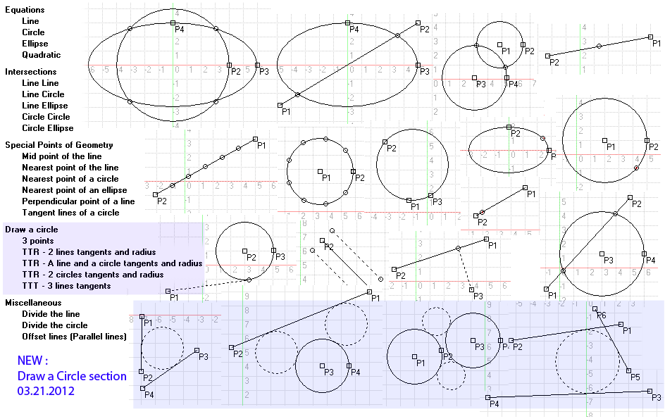



## EGL\_CADTools

### Description

The tools needed to make the industry standard CAD program. Was clean and simple coding. Here you can learn the basics of algebra. You can learn more about the content by looking at a screen shot. For example, collection of the intersection ,of the geometry on the presence of the special points, and so on. New: Draw a circle section (Zip: 38kb)
 
### More Info
 

             |
---                |---
**Submitted On**   |2012-03-20 23:55:04
**By**             |[Erkan Sanli](https://github.com/Planet-Source-Code/PSCIndex/blob/master/ByAuthor/erkan-sanli.md)
**Level**          |Intermediate
**User Rating**    |4.8 (24 globes from 5 users)
**Compatibility**  |VB 5\.0, VB 6\.0
**Category**       |[Graphics](https://github.com/Planet-Source-Code/PSCIndex/blob/master/ByCategory/graphics__1-46.md)
**World**          |[Visual Basic](https://github.com/Planet-Source-Code/PSCIndex/blob/master/ByWorld/visual-basic.md)
**Archive File**   |[EGL\_CADToo2221863212012\.zip](https://github.com/Planet-Source-Code/erkan-sanli-egl-cadtools__1-74306/archive/master.zip)

